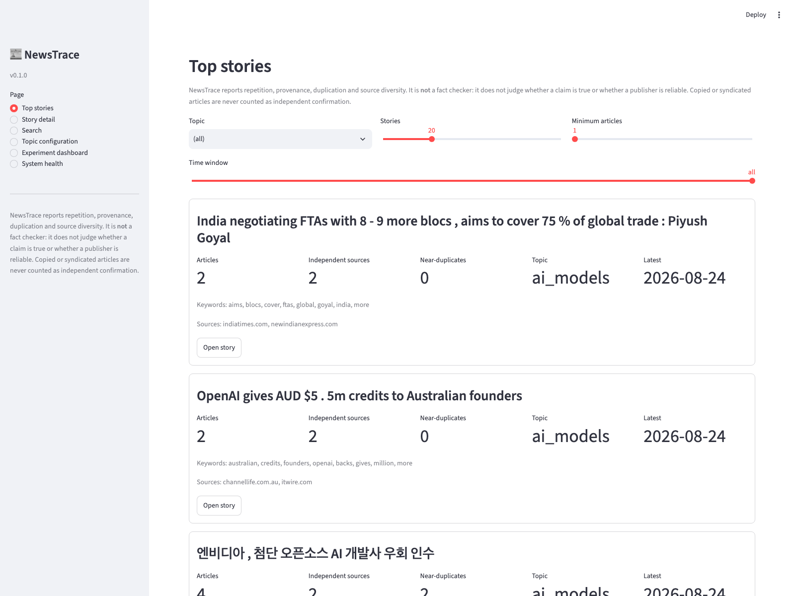
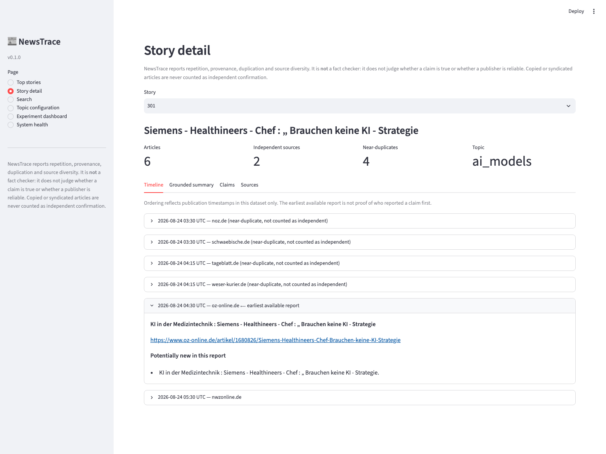
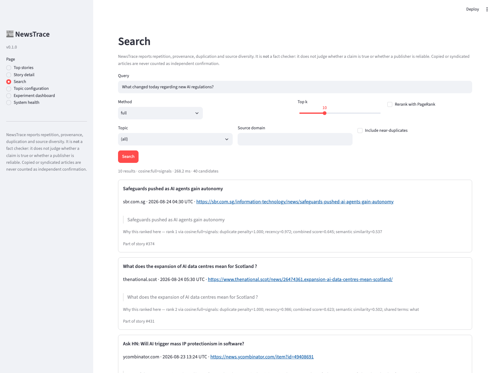
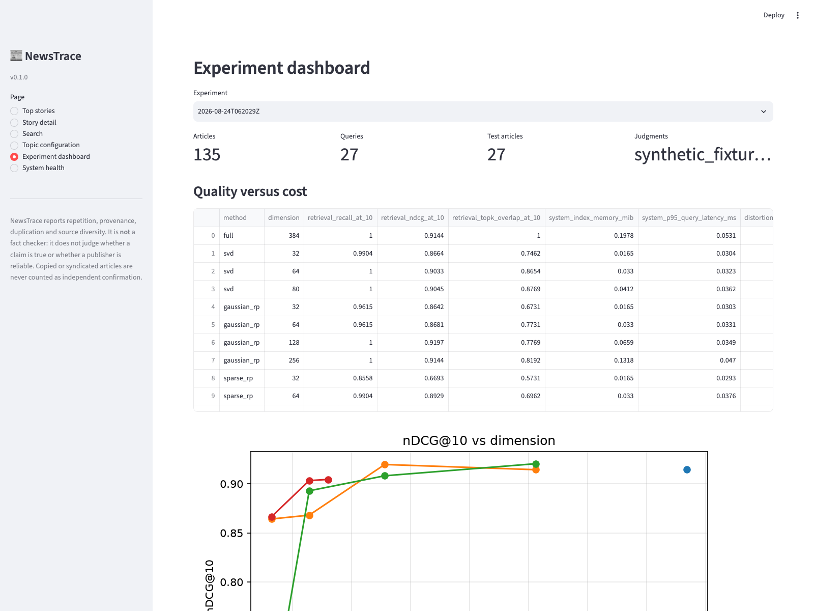
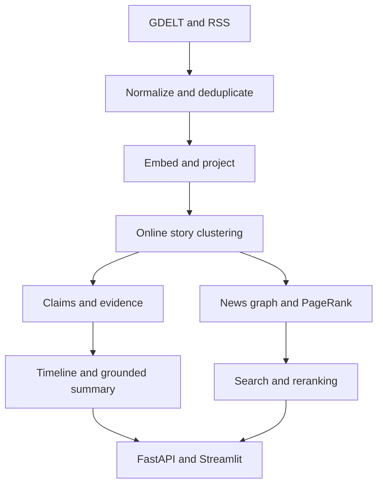

# NewsTrace

**A real-time news story, claim, and source-evidence tracker built as an applied MCS 549 project.**

NewsTrace continuously ingests AI and market-moving technology news, groups articles that describe the same event, tracks how each story changes over time, and produces evidence-grounded summaries with links to the original reporting.

This is **not** intended to be another generic news summarizer. The central research question is:

> How accurately and efficiently can a live news system cluster, retrieve, and rank articles when its embeddings are compressed and its data arrive as a stream?

The project should explicitly connect high-dimensional geometry, singular value decomposition, random projections, clustering, streaming algorithms, graphs, random walks, and Markov chains to measurable system behavior.

---

## Instructions for Claude Code

Read this file completely before editing anything.

1. Inspect the repository and preserve any existing user work.
2. Create a short implementation plan and then begin implementing it. Do not only describe the solution.
3. Implement milestones in order. Complete the MVP before adding optional features.
4. Run formatting, type checks, and tests after every milestone.
5. Use deterministic random seeds in experiments and tests.
6. Do not require a paid API key for ingestion, retrieval, clustering, evaluation, or the default extractive summaries.
7. Keep all LLM functionality behind an interface and make `LLM_PROVIDER=none` the default.
8. Do not claim that a source is trustworthy, biased, or factually correct. The system may report agreement, disagreement, provenance, duplication, and source diversity, but it is not a fact checker.
9. Do not count copied or syndicated articles as independent confirmation.
10. Respect robots.txt, publisher terms, rate limits, copyright, and paywalls. Store article metadata, short retrieved excerpts, and URLs by default—not unauthorized full-text archives.
11. Do not claim performance improvements until the benchmark scripts produce the numbers.
12. If an external service is unavailable, use committed fixtures so the application and tests still run.

Start with Milestones 0–3. Continue through later milestones when the earlier acceptance tests pass. Ask for input only when blocked by credentials, permissions, or a decision that materially changes the project.

---

## Product behavior

A user should be able to:

- Follow configurable topics such as AI agents, model releases, AI safety, semiconductors, and market-moving technology news.
- See multiple articles grouped into one evolving story rather than a repeated headline feed.
- Open a story timeline showing what was reported first and what information appeared later.
- Read an extractive or LLM-assisted multi-source summary with sentence-level evidence links.
- See which claims are repeated across distinct sources, which appear in only one source, and which appear to conflict.
- Search past stories using natural-language queries.
- Filter by time window, topic, source domain, language, and entity.
- View why a story or article was retrieved.
- Compare full-dimensional and compressed retrieval modes in an experiment dashboard.

Example query:

> What changed today regarding new AI regulations?

Expected answer structure:

1. **New developments** — information not present in earlier articles in the story cluster.
2. **Repeated reporting** — claims appearing in multiple non-duplicate sources.
3. **Single-source claims** — important claims presently supported by only one retrieved source.
4. **Disagreements or uncertainty** — attributed statements that cannot be reconciled from the available evidence.
5. **Evidence** — article title, publisher domain, timestamp, URL, and supporting excerpt for every summary statement.

---

## Screenshots

Captured from the live corpus with `make screenshots`
([`scripts/capture_screenshots.py`](scripts/capture_screenshots.py)), so they can
be refreshed rather than hand-taken.

| | |
| --- | --- |
|  |  |
| **Top stories** — evolving stories with article and independent-source counts | **Story detail** — timeline, earliest available report, and near-duplicates marked as not independent |
|  |  |
| **Search** — every hit carries provenance and a "why this ranked here" line | **Experiment dashboard** — full versus compressed retrieval, from saved metrics |

The story-detail shot is the duplication behaviour working on real data: six
articles, four of them German regional syndications of one wire story, counted
as **two** independent sources rather than six.

---

## Scope

### MVP

The first complete version must include:

- GDELT DOC 2.0 ingestion and configurable RSS ingestion.
- Article normalization, canonical URL handling, and duplicate detection.
- Sentence-transformer embeddings.
- Full-dimensional cosine retrieval baseline.
- Online story clustering within a configurable time window.
- Story pages with timelines and source links.
- Citation-grounded extractive summaries.
- FastAPI API and a small Streamlit interface.
- SQLite persistence for local development.
- Reproducible tests using local fixtures.
- Benchmark framework for retrieval, clustering, latency, memory, and throughput.

### Research extension

After the MVP works, add:

- Truncated SVD.
- Gaussian random projection.
- Sparse random projection.
- Dimension sweeps over `32, 64, 128, 256`, bounded by the original embedding dimension.
- Streaming centroid updates and incremental article assignment.
- Article/source/story/entity graph.
- Personalized PageRank reranking.
- Claim extraction and cautious agreement/disagreement labeling.
- Experiment reports and plots comparing quality with computational cost.

### Out of scope for the initial version

- Scraping the entire internet.
- Training a foundation model.
- Automated trading or investment recommendations.
- Political-bias scoring.
- Declaring claims true or false.
- Circumventing paywalls or publisher restrictions.
- A complex distributed architecture before local benchmarks justify it.
- Mobile applications or browser extensions.

---

## MCS 549 connections

| Course topic | NewsTrace implementation | Required measurement |
| --- | --- | --- |
| High-dimensional geometry | Analyze cosine-neighbor preservation after compression | Pairwise distortion and top-*k* neighbor overlap |
| Singular value decomposition | Truncated SVD compression of article embeddings | Recall/nDCG, memory, and latency by dimension |
| Random projections | Gaussian and sparse projections | Empirical distance distortion and JL-style dimension discussion |
| Clustering | Group articles describing the same event | Pairwise precision/recall/F1 and B-cubed F1 |
| Streaming algorithms | Incremental ingest, deduplication, cluster updates, bounded recent state | Ingestion throughput, update latency, and peak memory |
| Random graphs | Construct an article-source-claim-entity graph | Graph size, degree distribution, and component structure |
| Random walks | Query- or story-seeded Personalized PageRank | Ranking nDCG/Recall change versus cosine-only retrieval |
| Markov chains | Interpret PageRank as a stationary distribution over the news graph | Convergence iterations and sensitivity to damping factor |

---

## Data sources

### Primary: GDELT DOC 2.0

Use the official endpoint:

```text
https://api.gdeltproject.org/api/v2/doc/doc
```

Example request:

```text
https://api.gdeltproject.org/api/v2/doc/doc?query=(%22artificial%20intelligence%22%20OR%20OpenAI%20OR%20Anthropic%20OR%20DeepMind)&mode=artlist&format=json&maxrecords=250&timespan=24h&sort=datedesc
```

Important implementation rules:

- Construct query parameters with the HTTP client's parameter encoder; do not manually concatenate user input into URLs.
- Use exponential backoff with jitter for transient failures.
- Cache raw API responses for reproducibility.
- Record retrieval time separately from the publisher's article timestamp.
- Deduplicate by canonical URL and normalized content signals.
- GDELT coverage is not complete or unbiased; document this limitation in experiment reports.

Official documentation:

- <https://www.gdeltproject.org/data.html>
- <https://blog.gdeltproject.org/gdelt-doc-2-0-api-debuts/>

### Secondary: RSS/Atom

Support a user-owned YAML list of permitted feeds. RSS is useful for stable testing and for following selected publishers. Do not commit private feed URLs or credentials.

```yaml
topics:
  ai_models:
    gdelt_query: '("artificial intelligence" OR OpenAI OR Anthropic OR DeepMind OR "large language model")'
    feeds: []
  ai_safety:
    gdelt_query: '("AI safety" OR "AI security" OR "prompt injection" OR "model evaluation")'
    feeds: []
  chips_and_compute:
    gdelt_query: '(Nvidia OR semiconductor OR GPU OR "AI chip")'
    feeds: []
```

### Article text

For the MVP, prefer title, metadata, RSS description, and excerpts returned through permitted APIs. Optional article extraction may use `trafilatura` only for allow-listed publishers and must honor robots.txt, terms, rate limits, and paywalls. Store the retrieval status and extraction method for auditing.

---

## Technical stack

- **Language:** Python 3.11+
- **Package/environment:** `uv` with a standards-compliant `pyproject.toml`; document a `pip` fallback
- **API:** FastAPI + Pydantic v2
- **UI:** Streamlit
- **Database:** SQLite + SQLAlchemy 2.x for the MVP
- **Migrations:** Alembic
- **HTTP:** `httpx`
- **Feeds:** `feedparser`
- **Text extraction:** `trafilatura` as an optional extra
- **Embeddings:** `sentence-transformers/all-MiniLM-L6-v2`
- **Numerical/ML:** NumPy, SciPy, scikit-learn
- **Graph:** NetworkX
- **Baseline retrieval:** vectorized NumPy cosine similarity
- **Optional approximate index:** FAISS or hnswlib only after the exact baseline is validated
- **Scheduling:** APScheduler or a simple CLI loop; avoid Celery/Redis in the MVP
- **Testing:** pytest, pytest-asyncio, respx
- **Quality:** Ruff, MyPy
- **Plots/reports:** pandas, matplotlib, seaborn

The default application must run on CPU. Detect GPU availability but never require it.

---

## Proposed repository structure

```text
.
├── README.md
├── pyproject.toml
├── .env.example
├── .gitignore
├── Makefile
├── alembic.ini
├── configs/
│   ├── topics.example.yaml
│   └── sources.example.yaml
├── data/
│   ├── fixtures/
│   ├── labels/
│   └── raw/                  # ignored except small fixtures
├── artifacts/               # generated metrics/plots; large files ignored
├── docs/
│   ├── architecture.md
│   ├── evaluation.md
│   ├── limitations.md
│   └── model_card.md
├── migrations/
├── src/newstrace/
│   ├── __init__.py
│   ├── config.py
│   ├── logging.py
│   ├── db.py
│   ├── models.py
│   ├── schemas.py
│   ├── cli.py
│   ├── ingestion/
│   │   ├── base.py
│   │   ├── gdelt.py
│   │   ├── rss.py
│   │   ├── normalize.py
│   │   └── deduplicate.py
│   ├── representations/
│   │   ├── embedder.py
│   │   ├── projection.py
│   │   └── registry.py
│   ├── clustering/
│   │   ├── online.py
│   │   └── labeling.py
│   ├── retrieval/
│   │   ├── exact.py
│   │   ├── rerank.py
│   │   └── explain.py
│   ├── claims/
│   │   ├── extract.py
│   │   ├── compare.py
│   │   └── evidence.py
│   ├── graph/
│   │   ├── build.py
│   │   └── pagerank.py
│   ├── summarization/
│   │   ├── base.py
│   │   ├── extractive.py
│   │   └── llm.py
│   ├── evaluation/
│   │   ├── retrieval.py
│   │   ├── clustering.py
│   │   ├── summaries.py
│   │   ├── systems.py
│   │   └── report.py
│   └── api/
│       ├── app.py
│       └── routes/
├── app/
│   └── streamlit_app.py
├── scripts/
│   ├── ingest_demo.py
│   ├── build_label_queue.py
│   ├── run_experiments.py
│   └── export_report.py
└── tests/
    ├── fixtures/
    ├── unit/
    ├── integration/
    └── smoke/
```

---

## Data model

At minimum, implement these entities.

### `Article`

- `id`
- `url`
- `canonical_url`
- `title`
- `description`
- `excerpt`
- `source_domain`
- `language`
- `published_at`
- `retrieved_at`
- `raw_payload_hash`
- `normalized_text_hash`
- `extraction_method`
- `is_near_duplicate`
- `duplicate_of_article_id`

### `StoryCluster`

- `id`
- `display_title`
- `topic`
- `created_at`
- `updated_at`
- `centroid_version`
- `article_count`
- `distinct_domain_count`

### `ClusterMembership`

- `article_id`
- `story_cluster_id`
- `similarity`
- `assignment_method`
- `assigned_at`

### `EmbeddingRecord`

- `article_id`
- `model_name`
- `method` (`full`, `svd`, `gaussian_rp`, `sparse_rp`)
- `dimension`
- `fit_version`
- `vector_path` or serialized vector reference

Do not store one database column per embedding dimension.

### `Claim`

- `id`
- `normalized_claim`
- `subject`
- `predicate`
- `object`
- `event_time`
- `extraction_method`
- `confidence`

### `ClaimEvidence`

- `claim_id`
- `article_id`
- `excerpt`
- `excerpt_start`
- `excerpt_end`
- `stance` (`reports`, `supports`, `disputes`, `unclear`)
- `confidence`

`supports` means that the passage supports the extracted claim, not that the claim is objectively true.

### `IngestionRun` and `EvaluationRun`

Persist configuration, git commit when available, random seed, start/end times, counts, failures, and artifact paths so results can be reproduced.

---

## Processing pipeline



### 1. Normalize

- Normalize Unicode and whitespace.
- Remove obvious tracking query parameters.
- Extract a canonical URL when available.
- Preserve the original URL.
- Normalize timestamps to UTC.
- Store source-domain and language metadata.

### 2. Deduplicate

Use multiple signals:

1. Exact canonical URL.
2. Exact normalized title hash.
3. Token or character similarity for near-duplicate titles.
4. Optional SimHash/MinHash over available excerpts.
5. Publication-time proximity.

Do not delete duplicates. Preserve them, mark their relationship, and exclude them from independent-source counts.

### 3. Embed

Embed `title + description/excerpt` with the configured sentence-transformer. Cache embeddings by the hash of:

```text
model_name + preprocessing_version + normalized_text
```

### 4. Project

Provide a common interface:

```python
class Projector(Protocol):
    def fit(self, x: NDArray[np.float32]) -> "Projector": ...
    def transform(self, x: NDArray[np.float32]) -> NDArray[np.float32]: ...
    def save(self, path: Path) -> None: ...
```

Implement identity/full embeddings first, then TruncatedSVD, GaussianRandomProjection, and SparseRandomProjection. Fit transformations only on the training or historical window to prevent look-ahead leakage.

### 5. Online story clustering

Initial algorithm:

1. Restrict candidate clusters to a recent configurable time window, such as 72 hours.
2. Retrieve the nearest cluster centroids.
3. Combine cosine similarity with title-token overlap and entity overlap.
4. Assign the article when the score exceeds a tuned threshold.
5. Otherwise create a new story cluster.
6. Update the centroid incrementally.

Do not tune and evaluate the threshold on the same labeled pairs.

### 6. Story timeline

For each cluster:

- Sort non-duplicate articles by publication time.
- Extract candidate sentences containing named entities, quantities, dates, or attributed statements.
- Mark a sentence as potentially new when it is sufficiently dissimilar from prior evidence.
- Show the earliest available source for each extracted claim, while acknowledging that the dataset may not contain the true first report.

### 7. Graph and random-walk ranking

Graph node types:

- Article
- Source domain
- Story
- Claim
- Entity

Graph edge types:

- `PUBLISHED_BY`
- `BELONGS_TO`
- `REPORTS`
- `DISPUTES`
- `MENTIONS`
- `NEAR_DUPLICATE_OF`

Use weighted Personalized PageRank seeded by the user's query or selected story. Candidate edge weights may include semantic relevance, recency decay, and a duplication penalty. Do not use an unexplained publisher-reputation score.

### 8. Summarization

The default summarizer must be extractive and deterministic. Every summary item must carry one or more evidence records.

The optional LLM summarizer must:

- Receive only retrieved evidence and metadata.
- Produce structured JSON validated by Pydantic.
- Return evidence IDs for every statement.
- Reject or omit statements without valid evidence IDs.
- Clearly label single-source and disputed claims.
- Fall back to the extractive summarizer on API failure or validation failure.

---

## Retrieval and experiment design

### Retrieval baselines

Implement and compare:

1. Lexical TF-IDF baseline.
2. Full sentence-transformer embeddings.
3. Truncated SVD embeddings.
4. Gaussian random projection embeddings.
5. Sparse random projection embeddings.
6. Full or compressed retrieval followed by Personalized PageRank reranking.

BM25 may be added later, but TF-IDF is sufficient for the first no-extra-service baseline.

### Experimental split

Use a chronological split:

- **Fit/train:** earliest 60% of articles.
- **Validation:** next 20%.
- **Test:** latest 20%.

Fit SVD, clustering thresholds, and any calibration only on the fit/validation period. Report final metrics once on the held-out test period.

### Retrieval metrics

- Recall@5 and Recall@10
- Precision@5 and Precision@10
- MRR
- nDCG@10
- Top-*k* neighbor overlap with the full-dimensional baseline
- Pairwise cosine/distance distortion

### Clustering metrics

- Pairwise precision, recall, and F1
- B-cubed precision, recall, and F1
- Adjusted Rand Index as a secondary metric
- Cluster fragmentation and merge-error rates

### System metrics

- Embedding/index memory in MiB
- Serialized index size
- p50 and p95 query latency
- Articles ingested per second
- Per-article streaming update latency
- Peak resident memory during ingestion and evaluation
- Projection fit and transform time
- PageRank convergence iterations and time

### Summary/evidence metrics

- Citation precision: fraction of summary statements supported by their cited excerpts
- Citation coverage: fraction of summary statements containing citations
- Unsupported-claim rate
- Redundancy rate
- Source-domain diversity
- Human review on a small, versioned sample

An LLM-as-judge score may be reported only as a secondary diagnostic and must identify the judging model and prompt version.

### Labels

Claude should create:

- A labeling script that samples difficult article pairs near the clustering threshold.
- `data/labels/story_pairs.template.csv` with the schema and a few synthetic examples.
- A retrieval-judgment template with query, article, relevance, and reviewer notes.

Do not fabricate hundreds of human labels. The project owner will review and label real examples. Automated tests should use synthetic fixtures with known clusters.

---

## API contract

Implement at least:

```text
GET  /health
POST /ingestion/runs
GET  /ingestion/runs/{run_id}
GET  /topics
GET  /stories
GET  /stories/{story_id}
GET  /stories/{story_id}/timeline
GET  /stories/{story_id}/claims
POST /search
POST /summaries/story/{story_id}
POST /experiments
GET  /experiments/{experiment_id}
```

Example search request:

```json
{
  "query": "new AI model security evaluations",
  "topic": "ai_safety",
  "start_time": "2026-08-01T00:00:00Z",
  "end_time": "2026-08-31T00:00:00Z",
  "method": "gaussian_rp",
  "dimension": 128,
  "rerank_with_pagerank": true,
  "top_k": 10
}
```

Every search result must include:

- Article/story identifier
- Title
- Source domain
- Publication time
- URL
- Retrieval score
- Ranking method
- Short evidence excerpt
- A human-readable explanation of the major ranking signals

---

## Streamlit pages

Keep the UI simple and diagnostic.

1. **Top stories** — clusters ordered by recency and coverage.
2. **Story detail** — timeline, source list, claims, evidence, and duplicate count.
3. **Search** — query, filters, results, and retrieval explanations.
4. **Topic configuration** — read-only view in MVP; configuration remains YAML-based.
5. **Experiment dashboard** — quality-versus-memory and quality-versus-latency plots.
6. **System health** — last ingestion run, failures, counts, and model/index versions.

Never hide source links behind generated prose.

---

## Configuration

Create `.env.example`:

```dotenv
NEWSTRACE_ENV=development
NEWSTRACE_DATABASE_URL=sqlite:///./newstrace.db
NEWSTRACE_LOG_LEVEL=INFO
NEWSTRACE_RANDOM_SEED=549
NEWSTRACE_TOPICS_FILE=configs/topics.example.yaml
NEWSTRACE_EMBEDDING_MODEL=sentence-transformers/all-MiniLM-L6-v2
NEWSTRACE_CLUSTER_WINDOW_HOURS=72
NEWSTRACE_CLUSTER_THRESHOLD=0.88
NEWSTRACE_CLUSTER_THRESHOLD_HASHING=0.74
NEWSTRACE_HTTP_USER_AGENT=NewsTraceResearch/0.1
LLM_PROVIDER=none
ANTHROPIC_API_KEY=
OPENAI_API_KEY=
```

The clustering thresholds above are **measured, not guessed**: both were selected
by `newstrace.evaluation.tuning` on the fit+validation window of the committed
fixtures only (see `docs/evaluation.md`). Cosine similarity is not comparable
across embedding backends, so the deterministic hashing fallback that runs when
the `embeddings` extra is absent carries its own value. Re-tune whenever the
embedder, corpus or topic mix changes. The full list of settings is in
`.env.example`.

Never commit `.env`, API keys, raw unrestricted article bodies, large embeddings, or generated databases.

---

## Commands to provide

Claude must make these commands work or adjust this README to match the final implementation.

### Setup with `uv`

```bash
uv sync --all-extras
cp .env.example .env
uv run alembic upgrade head
```

### `pip` fallback

```bash
python -m venv .venv
source .venv/bin/activate
python -m pip install -e ".[dev]"
cp .env.example .env
alembic upgrade head
```

### Run a fixture-backed demo

```bash
uv run python scripts/ingest_demo.py --source fixtures
uv run uvicorn newstrace.api.app:app --reload
uv run streamlit run app/streamlit_app.py
```

### Run a live GDELT ingestion

```bash
uv run newstrace ingest --topic ai_models --timespan 24h --max-records 250
```

GDELT answers 429 with *"limit requests to one every 5 seconds"*, so
`configs/sources.example.yaml` gives `api.gdeltproject.org` its own 5.5 s
interval; per-domain limits always beat the global default. Expect to be
throttled anyway if you sweep hard — the API also applies a longer-term
allowance per IP, and a rejected run is recorded as `failed` without touching
the stored corpus.

One `artlist` response carries at most 250 records. `--windows N` splits the
timespan into N consecutive sub-windows to get past that cap, at the cost of N
requests per topic:

```bash
uv run newstrace ingest --source gdelt --timespan 7d --windows 7 --max-records 250
```

### Run a live RSS ingestion

`configs/topics.live.yaml` carries public, publisher-operated feeds for the four
default topics. Point the config at it and ingest:

```bash
NEWSTRACE_TOPICS_FILE=configs/topics.live.yaml \
  uv run newstrace ingest --source rss
```

### Search from the CLI

```bash
uv run newstrace search "AI agent security evaluations" --top-k 10
```

### Run experiments

```bash
uv run python scripts/run_experiments.py \
  --methods full,svd,gaussian_rp,sparse_rp \
  --dimensions 32,64,128,256 \
  --seed 549
```

### Capture documentation screenshots

Screenshots are scripted so they can be refreshed honestly. Start the UI, then
capture from it in a second shell:

```bash
uv sync --extra screenshots && uv run playwright install chromium
uv run streamlit run app/streamlit_app.py     # shell 1
uv run python scripts/capture_screenshots.py  # shell 2
```

Playwright is an optional extra: the application, tests and experiments never
require a browser.

### Quality checks

```bash
uv run ruff format --check .
uv run ruff check .
uv run mypy src
uv run pytest -q
```

### Convenience targets

Provide these Make targets:

```text
make setup
make db
make demo
make api
make ui
make ingest
make experiment
make screenshots
make test
make lint
make check
```

---

## Milestones and acceptance criteria

### Milestone 0 — Scaffold and offline smoke test

Deliver:

- Project structure, configuration, logging, database, migration, and CLI.
- Committed GDELT/RSS fixtures containing synthetic or legally redistributable metadata.
- `/health` endpoint.
- One command that loads fixtures and displays a basic story list.

Acceptance:

- `make check` passes.
- `make demo` works without network access or API keys.
- Re-running fixture ingestion is idempotent.

### Milestone 1 — Live ingestion and deduplication

Deliver:

- GDELT and RSS adapters behind a shared interface.
- Retry, timeout, caching, and rate-limiting behavior.
- URL/title/excerpt deduplication.
- Ingestion-run audit records.

Acceptance:

- Live ingestion failure does not corrupt the database.
- Duplicate fixtures are preserved but correctly linked.
- Tests cover retries, malformed payloads, timestamps, and idempotency.

### Milestone 2 — Embeddings, search, and online clustering

Deliver:

- Cached embeddings.
- Exact cosine retrieval and TF-IDF baseline.
- Online story clustering.
- Search and story APIs.

Acceptance:

- Synthetic articles known to describe the same event form the expected clusters.
- Search results contain evidence, provenance, and ranking explanations.
- Chronological evaluation split is enforced.

### Milestone 3 — Timeline, extractive summaries, and UI

Deliver:

- Story timelines.
- Deterministic extractive multi-source summaries.
- Streamlit Top Stories, Story Detail, Search, and Health pages.

Acceptance:

- Every summary sentence links to at least one evidence record.
- Duplicate articles do not inflate independent-source counts.
- The complete fixture-backed workflow runs locally.

### Milestone 4 — Dimensionality-reduction experiments

Deliver:

- SVD, Gaussian RP, and sparse RP implementations.
- Saved fit artifacts with version metadata.
- Dimension sweep and benchmark reports.

Acceptance:

- No fit operation sees held-out test-period articles.
- Results include quality, distortion, memory, latency, and throughput.
- Tables and plots are generated from saved machine-readable results.

### Milestone 5 — Graph and PageRank

Deliver:

- Typed news graph.
- Personalized PageRank reranker.
- Graph statistics and convergence analysis.

Acceptance:

- PageRank probabilities sum to approximately one.
- Tests cover dangling nodes and disconnected components.
- Retrieval metrics compare reranked and non-reranked systems.

### Milestone 6 — Claims and optional LLM summaries

Deliver:

- Claim/evidence schema and extraction interface.
- Conservative agreement/disagreement comparison.
- Optional Anthropic/OpenAI adapters.
- Structured-output validation and extractive fallback.

Acceptance:

- The no-key path still passes all tests.
- Invalid or uncited LLM statements are rejected.
- UI labels uncertainty and does not present agreement as truth.

### Milestone 7 — Portfolio release

Deliver:

- Architecture, evaluation, limitations, and model-card documentation.
- Dockerfile and optional Docker Compose configuration.
- Reproducibility instructions.
- Screenshots or a short demonstration video.
- Final experiment report.

Acceptance:

- A new user can run the fixture demo from the README.
- No secret, private feed, copyrighted article archive, or large generated artifact is committed.
- Resume claims are copied only from measured results.

---

## Testing requirements

At minimum, test:

- GDELT/RSS payload parsing.
- Canonical URL normalization.
- Timestamp normalization.
- Exact and near-duplicate detection.
- Embedding cache keys.
- Projection output dimensions and deterministic seeds.
- No train/test leakage in projector fitting.
- Online centroid updates.
- Cluster threshold behavior.
- Cosine retrieval ordering.
- PageRank normalization and convergence.
- Evidence-to-summary validation.
- API response schemas.
- Database idempotency.
- Offline smoke workflow.

Use small deterministic fixtures. Mark network tests separately and exclude them from the default test run.

---

## Experiment outputs

Every experiment should create a timestamped directory such as:

```text
artifacts/experiments/2026-08-21T120000Z/
├── config.json
├── environment.json
├── metrics.json
├── per_query_metrics.parquet
├── per_cluster_metrics.parquet
├── quality_vs_dimension.png
├── quality_vs_memory.png
├── quality_vs_latency.png
└── report.md
```

`environment.json` should record Python and package versions, platform, CPU/GPU availability, seed, dataset hashes, and git commit when available.

The final report must separate:

- Observed results.
- Statistical uncertainty.
- Engineering interpretations.
- Limitations.
- Hypotheses for future work.

---

## Success targets

These are goals, not promised results:

- Preserve at least 95% of full-embedding Recall@10 at a lower dimension.
- Reduce embedding storage by at least 3×.
- Improve p95 exact-search latency relative to full embeddings.
- Maintain acceptable clustering F1 on the chronological test period.
- Achieve 100% citation coverage for generated summary statements.
- Demonstrate that duplicate suppression changes source-count and ranking behavior correctly.

Report failures honestly. A negative result—such as severe quality loss under projection—can still be a strong research outcome when the experiment is rigorous.

---

## Resume bullet

Every figure below is taken from
[`docs/experiments/live-30d/metrics.json`](docs/experiments/live-30d/metrics.json)
and can be checked against it:

> Built a streaming news-intelligence system over **3,191 live-ingested articles
> from 292 domains**, applying online clustering, truncated SVD and random
> projections, and personalized-PageRank reranking; cut embedding memory by
> **92%** (1.64 MiB → 0.14 MiB at d=32) and p95 query latency by **7×** (0.64 ms
> → 0.09 ms) with **no measurable loss** in nDCG@10, and shipped
> citation-grounded story timelines at **100% citation coverage**.

"No measurable loss" is the honest phrasing and the one to defend: SVD at d=32
scored 0.875 against the baseline's 0.833, but the paired bootstrap interval on
that difference is [0.000, 0.112] and contains zero, as does every other
interval in the run. The claim is that compression cost nothing detectable on 23
silver-labelled queries — not that it helped. The memory and latency figures
need no labels and carry no such caveat.

---

## Limitations to document

- GDELT and selected feeds do not represent all journalism.
- Publication timestamp is not proof that a source originated a claim.
- Similar wording can indicate copying rather than independent corroboration.
- Contradiction detection is uncertain and context-dependent.
- Source counts do not establish truth.
- Embedding similarity can merge distinct events or split one evolving event.
- LLM summaries can omit nuance even when their individual statements are cited.
- Results from AI/technology news may not generalize to politics, medicine, or local news.
- Market-moving relevance is retrospective unless evaluated under a strict point-in-time protocol.

---

## Future work

Only consider these after the core experiments are complete:

- Multilingual clustering and cross-lingual story alignment.
- Approximate-nearest-neighbor indexes.
- Adaptive clustering thresholds by topic and article age.
- Change-point detection for story bursts.
- Count-Min Sketch for approximate trending-entity counts.
- Reservoir sampling for bounded-memory review sets.
- Active learning to prioritize uncertain article pairs for human labeling.
- Temporal knowledge graphs.
- Point-in-time market-event studies without look-ahead leakage.
- User-personalized random-walk ranking.

---

## Definition of done

NewsTrace is complete for the course/portfolio milestone when:

1. The fixture demo and live ingestion path both work.
2. Articles are deduplicated, embedded, clustered, searchable, and displayed as evolving stories.
3. Summaries are evidence-grounded and source links are visible.
4. Full, SVD, Gaussian RP, and sparse RP variants are evaluated chronologically.
5. Graph/PageRank reranking is compared against non-graph retrieval.
6. The repository contains reproducible metrics, plots, tests, and limitations.
7. Every resume claim is supported by a saved experiment artifact.

At that point, prioritize improving the experiments and written analysis over adding more UI features.
