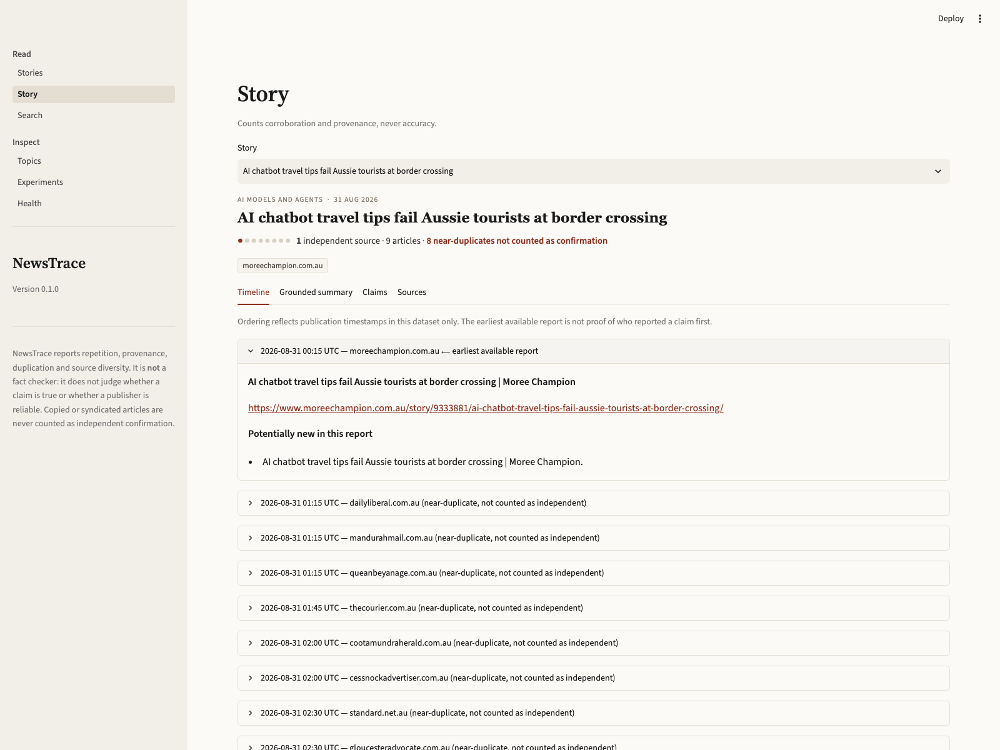

# NewsTrace

[](https://github.com/nhidinh2/newTrace/actions/workflows/ci.yml)

Real-time news **story** tracker: it ingests AI and technology news, groups the
articles that cover the same event into one evolving story, and answers queries
with summaries where every statement links back to the reporting it came from.

The interesting part is the measurement: **how much can you compress the
embeddings of a live news stream before retrieval quality suffers?** On a
30-day live corpus a 12× smaller index ranked no worse — while returning a
different half of the result set. Run the same sweep against 300 human
relevance judgments and that result reverses: the same 12× index loses 0.19
nDCG@10, with an interval nowhere near zero. **The live corpus was not
measuring compression. It was measuring 23 queries.** Both runs are below.

| | |
| --- | --- |
|  |  |
| **Stories** — article and *independent*-source counts | **Story** — timeline, earliest report, near-duplicates marked |
|  |  |
| **Search** — every hit carries provenance and a "why this ranked here" line | **Experiments** — full vs. compressed retrieval, from saved metrics |

That story page is the duplicate handling doing real work: nine articles, eight
of them regional syndications of a single wire story, counted as **one**
independent source rather than nine.

## Quickstart

No API key, no GPU, no network — the demo runs on committed fixtures.

```bash
make setup    # dependencies + .env
make db       # alembic upgrade head
make demo     # ingest fixtures
make ui       # Streamlit on :8501   (make api for the FastAPI service)
```

Every target runs through [`scripts/run.sh`](scripts/run.sh), which uses
[uv](https://docs.astral.sh/uv/) when it is installed and falls back to
`.venv` when it is not, so a checkout without uv still works.

Live ingestion once that works:

```bash
make refresh                                # RSS + GDELT, every topic
make refresh TOPIC=ai_models TIMESPAN=7d    # one topic, wider window
scripts/run.sh newstrace search "AI agent security evaluations" --top-k 10
```

`make refresh` wraps [`scripts/refresh.sh`](scripts/refresh.sh). Both adapters
run with `--refresh` — the HTTP response cache never expires, so that an
experiment can be replayed from disk, and a live pull has to bypass it — each
reports its inserted count, and one adapter failing (a rate-limited GDELT
fetch, typically) does not cost you the other. Feeds and GDELT queries come
from [`configs/topics.live.yaml`](configs/topics.live.yaml): 52 publisher feeds
across 6 topics. `make ui` reads the database per request, so a browser reload
is enough to see the new stories.

A database created before the blocking keys and the full-text index existed
needs one pass to build them:

```bash
make db && make backfill    # SimHash bands, title prefix tokens, FTS5 rows
```

`make help` lists every target; `make check` runs lint, types and tests, which
is also what CI runs on every push, alongside a job that replays this
quickstart offline.

## Results

From [`docs/experiments/live-30d`](docs/experiments/live-30d), a run committed
on 2026-08-24: 3,191 articles ingested from GDELT DOC 2.0 and 36 publisher
feeds across 292 domains, swept over the most recent 30 days (1,120 articles,
23 silver-labelled queries). The live corpus has since roughly doubled — 6,320
articles across 916 domains as of 2026-09-20, after the feed list grew to 52 —
and the sweep has not been re-run against it. The numbers below belong to the
committed run.

| Retrieval | dim | nDCG@10 | Recall@10 | top-10 overlap | mean \|Δcos\| | Index | p95 latency |
| --- | ---: | ---: | ---: | ---: | ---: | ---: | ---: |
| Full embeddings | 384 | 0.833 | 0.913 | — | — | 1.64 MiB | 0.64 ms |
| Truncated SVD | 32 | 0.875 | 0.913 | 0.49 | 0.154 | 0.14 MiB | 0.09 ms |
| Gaussian RP | 32 | 0.843 | 0.913 | 0.29 | 0.142 | 0.14 MiB | 0.09 ms |
| Sparse RP | 32 | 0.817 | 0.913 | 0.30 | 0.144 | 0.14 MiB | 0.10 ms |
| TF-IDF, lexical | — | 0.874 | 0.913 | 0.34 | — | 1.02 MiB | 0.38 ms |

**92% less embedding memory, 7× faster p95 queries, and not one paired
bootstrap interval that excludes zero** — across all twelve configurations.
SVD@32 beat the baseline on nDCG, but the interval on that difference is
[0.000, 0.112].

That last sentence was always doing more work than it looked like, and
[the benchmark run below](#what-the-benchmark-says) is what it was hiding.

The last two columns are why "no measurable loss" is not the same as
"lossless", and they are the more interesting result. SVD@32 shares only **49%
of its top-10** with the full-dimensional baseline; the random projections
share under a third, at a mean cosine error around 0.15. These indexes are not
returning the same documents slightly re-ordered — they are returning
substantially *different* documents, and scoring the same either way. Whatever
is carrying the ranking here survives distortion that JL would call severe.

The TF-IDF row is the other half of it: a lexical baseline with no embeddings
at all scores 0.874, above the 384-d dense pipeline, sharing 34% of its top-10.
The defensible reading of this run is that **23 silver-labelled queries cannot
separate these representations** — so the compression finding is a claim about
cost, not about quality. Separating them needs a corpus with more paraphrase
and less proper-noun overlap.

Also from this run: a typed graph of 8,367 nodes and 20,518 edges (94% in one
component), and power-iteration PageRank with explicit dangling-node
redistribution — converged on every query, stationary-mass error 9.8e-15, and a
top-10 that does not change between damping 0.5 and 0.95 even as convergence
goes from 28 iterations to 355. Clustering F1, ingestion throughput and 100%
citation coverage on generated summaries are in
[`docs/evaluation.md`](docs/evaluation.md).

### What the benchmark says

23 silver-labelled queries could not separate these representations, which the
run above reports as its own main caveat. SciFact has **300 queries with human
relevance judgments** over 5,183 documents, and the projectors are
corpus-agnostic, so the identical sweep runs there
([`docs/experiments/beir-scifact`](docs/experiments/beir-scifact)):

| Retrieval | dim | nDCG@10 | Recall@10 | top-10 overlap | Index | Δ nDCG vs full (95% CI) |
| --- | ---: | ---: | ---: | ---: | ---: | ---: |
| Full embeddings | 384 | 0.648 | 0.788 | — | 7.59 MiB | baseline |
| Truncated SVD | 256 | 0.647 | 0.790 | 0.96 | 5.06 MiB | −0.002 [−0.007, +0.003] |
| Truncated SVD | 128 | 0.619 | 0.770 | 0.81 | 2.53 MiB | −0.030 [−0.046, −0.015] |
| Truncated SVD | 64 | 0.559 | 0.703 | 0.65 | 1.27 MiB | −0.089 [−0.119, −0.061] |
| Truncated SVD | 32 | 0.461 | 0.606 | 0.47 | 0.63 MiB | −0.187 [−0.229, −0.147] |
| Gaussian RP | 32 | 0.321 | 0.451 | 0.22 | 0.63 MiB | −0.327 [−0.374, −0.281] |
| Sparse RP | 32 | 0.283 | 0.401 | 0.20 | 0.63 MiB | −0.365 [−0.413, −0.317] |
| TF-IDF, lexical | — | 0.642 | 0.779 | 0.32 | 12.68 MiB | −0.007 [−0.048, +0.034] |

Every dimension except 256 is worse by an interval that excludes zero. **12×
compression costs 29% of nDCG@10 here**; only 1.5× compression is
indistinguishable from the baseline. Nothing about the geometry changed
between the two runs — the measuring instrument did.

Two things survive the reversal. The top-10 overlap column still shows the
indexes returning substantially different documents (0.47 at SVD@32), so the
geometric claim holds; it is the *quality* claim that does not. And TF-IDF is
still statistically indistinguishable from the dense baseline, on a second
corpus, which is now a pattern rather than a quirk.

### Compression is not the only way to buy the memory

An approximate index buys it by scanning less instead of by shrinking the
vectors, and at matched memory on the live corpus the two are not close
([`docs/experiments/ann-live`](docs/experiments/ann-live)):

| Index | recall@10 vs exact | nDCG@10 | Index memory | p95 |
| --- | ---: | ---: | ---: | ---: |
| Exact, 384-d | 1.00 | 0.487 | 9.26 MiB | 0.65 ms |
| IVF-PQ, 96 subvectors, 16 probes | 0.86 | 0.469 | 1.05 MiB | 6.68 ms |
| Exact SVD@32 | 0.54 | 0.373 | 0.77 MiB | 0.17 ms |
| Exact Gaussian RP@32 | 0.36 | 0.369 | 0.77 MiB | 0.17 ms |

**0.86 against 0.54 recall of the exact top-10, at the same cost.** PQ
discards precision within a preserved geometry; a 32-d projection discards the
geometry. Recall here is measured against the exhaustive scan over the same
vectors, so it needs no judgments — which is exactly why it can separate what
the silver queries cannot.

The latency column is the catch: IVF-PQ is *slower* than the exhaustive scan
at 6,320 vectors, because a BLAS matrix-vector product beats a Python-driven
quantised lookup at this size. At this scale ANN buys memory, not latency.

## Serving the index

The retrieval numbers above are scan times. What a query actually costs is a
different question, and until recently the answer was "mostly not retrieval":
every request rebuilt the index from stored blobs, and the default filter read
every article row to collect ids. On the 6,320-article live corpus, per query:

| Stage | Before | Now | What changed |
| --- | ---: | ---: | --- |
| Collect the filtered id set | 40.5 ms | 2.3 ms | Covering index on `(is_near_duplicate, published_at, topic, source_domain, id)` |
| Materialise the index | 230 ms | 0.5 ms | Process-level cache, extended in place on ingest, re-checked per request with one aggregate query |
| Score and filter | 6.6 ms | 0.13 ms | Normalise once at build; `np.isin` instead of a Python membership loop |
| **Total, warm** | **~280 ms** | **~3 ms** | |

Ingestion moved the same way. Duplicate detection used to compare each
incoming article against a 96-hour window truncated at 2,000 rows — an
arbitrary subset once the corpus outgrew the cap — recomputing a SimHash for
both sides of every pair. It now blocks on SimHash bands and title prefix
tokens held in `article_signatures`: **644 candidates per article to 25, 21 ms
to 1.9 ms, and zero changed verdicts** on a 250-article sample against the
exhaustive scan. Both blocking schemes are complete for the thresholds they
serve, which is why the verdicts can be identical rather than merely similar
(eight 8-bit bands cover any pair within seven flipped bits; the rule accepts
at most five).

BM25 over SQLite's FTS5 is available as `--method bm25`, and is what the
`entity` filter now uses instead of lowercasing every article body in Python.

## How the numbers are kept honest

- **Chronological split, leakage-checked.** Projectors and the clustering
  threshold are fitted on the earliest 60% / next 20% of articles; reported
  numbers come from the last 20%. `ChronologicalSplit.assert_no_leakage()` runs
  before every experiment, so no projector has seen a test-period article.
- **Near-duplicates are excluded from the relevant set.** A syndicated copy is
  not independent coverage, so retrieving one earns no credit. Left in, every
  method scored an identical 0.917 — the task collapses to "find the
  near-identical article", which no representation can fail.
- **Thresholds are tuned on fit+validation only, per backend.** Cosine
  similarity is not comparable across embedding backends, so the threshold is
  stored twice: 0.88 for the sentence-transformer, 0.74 for the deterministic
  hashing fallback that keeps the whole suite runnable with no model download.
- **Every run is traceable.** `IngestionRun` and `EvaluationRun` record the git
  commit, seed, configuration, counts and failures. The HTTP layer keeps a
  content-addressed response cache, so a run replays from disk without
  refetching a publisher.
- **No reputation term anywhere.** Every contributing signal is carried on
  `ScoredHit.signals` and rendered as a "why this ranked here" line. A
  publisher-trust weight would not be explainable or justifiable, so there
  isn't one.

## Running the sweeps

Three harnesses, all reproducible from a committed corpus or a public one:

```bash
make experiment SINCE=30 QUERIES=200     # compression, on the live corpus
make ann SINCE=30                        # approximate retrieval vs exact
make beir DATASET=scifact DOWNLOAD=1     # compression, on human judgments
```

`make experiment` refreshes the stored compressed representations, so run it
before `make ann` — the comparison arm reads them, and every row in the ANN
table reports what fraction of the corpus its vectors cover so a stale fit
cannot be mistaken for a quality collapse.

The BEIR download is the only networked step in this repository, and it is
opt-in. `nfcorpus` and `arguana` are the same flag away; running them would
turn one benchmark result into a pattern.

## How it works

```
GDELT + RSS → normalize & dedupe → embed (MiniLM-L6-v2) → project (SVD / RP)
   → online clustering (72h window) → claims & evidence → graph + PageRank
   → FastAPI + Streamlit
```

Python 3.11+, SQLite/SQLAlchemy, FastAPI, Streamlit, sentence-transformers,
NumPy/scikit-learn, NetworkX. CPU-only by default; LLM summaries are optional
and off (`LLM_PROVIDER=none`) — the default summaries are extractive.

## What it does not do

It reports **agreement, provenance, duplication and source diversity**. It is
not a fact checker: it never scores a source's trustworthiness or bias, never
declares a claim true or false, and never treats a syndicated copy as
independent confirmation. Similar wording can mean copying rather than
corroboration, and source counts do not establish truth. Full list in
[`docs/limitations.md`](docs/limitations.md).

## Docs

- [Architecture](docs/architecture.md) — data flow, module map, design decisions
- [Evaluation](docs/evaluation.md) — protocol, metrics, uncertainty, reproduction
- [Limitations](docs/limitations.md) · [Model card](docs/model_card.md)
- [Experiments](docs/experiments) — committed runs on [fixtures](docs/experiments/baseline), [live data](docs/experiments/live-30d), [SciFact](docs/experiments/beir-scifact) and [approximate retrieval](docs/experiments/ann-live)
- [Specification](docs/spec.md) — the original design brief
- Harnesses: [`scripts/run_experiments.py`](scripts/run_experiments.py) (compression),
  [`scripts/run_ann.py`](scripts/run_ann.py) (approximate retrieval),
  [`scripts/run_beir.py`](scripts/run_beir.py) (public benchmark)

<details>
<summary><b>Techniques → implementation</b></summary>

| Technique | In NewsTrace | Measured by |
| --- | --- | --- |
| High-dimensional geometry | Cosine-neighbour preservation under compression | Pairwise distortion, top-*k* overlap |
| Singular value decomposition | Truncated SVD of article embeddings | nDCG/Recall vs. memory and latency |
| Random projections | Gaussian and sparse projections | Empirical distortion vs. JL bounds |
| Clustering | Online grouping of same-event articles | Pairwise F1, B-cubed F1 |
| Streaming algorithms | Incremental ingest, dedupe, centroid updates | Throughput, update latency, peak memory |
| Locality-sensitive hashing | SimHash bands + prefix filter for duplicate blocking | Candidates per article, verdict parity vs. full scan |
| Vector quantisation | IVF-PQ approximate index | Recall@10 vs. exact, memory, p95 |
| Random graphs | Article–source–claim–entity graph | Degree distribution, components |
| Random walks | Story-seeded Personalized PageRank | nDCG change vs. cosine-only |
| Markov chains | PageRank as a stationary distribution | Convergence iterations, damping sensitivity |

</details>
