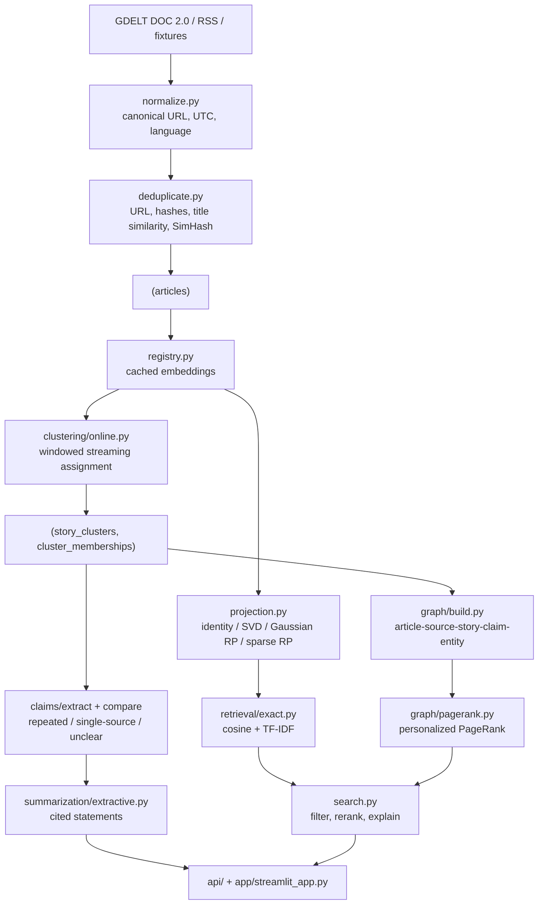

# Architecture

NewsTrace is a single Python package (`src/newstrace`) with four entry points —
CLI, FastAPI, Streamlit and the experiment scripts — over one SQLite database.
There is no queue, no worker pool and no service mesh: the local benchmarks in
`artifacts/experiments/` do not yet justify any of them.

## Data flow

## Module map

| Module | Responsibility |
| --- | --- |
| `config.py` | Environment-driven settings, topic and source-policy YAML |
| `db.py`, `models.py` | Engine/session management and the ORM schema |
| `ingestion/` | Source adapters, HTTP policy, normalisation, deduplication, run auditing |
| `representations/` | Embedding backends, the embedding cache, projectors |
| `clustering/` | Streaming assignment and rule-based labelling |
| `retrieval/` | Exact cosine, BM25/FTS5 and TF-IDF search, the index cache, the approximate index, reranking, explanations |
| `claims/` | Claim extraction, cross-source comparison, evidence persistence |
| `graph/` | Typed news graph and personalized PageRank |
| `summarization/` | Grounded extractive summaries; optional LLM adapter |
| `evaluation/` | Metrics, chronological split, threshold tuning, the compression, approximate-retrieval and BEIR runners, reports |
| `stories.py`, `search.py`, `pipeline.py` | Service layer shared by every entry point |

## Design decisions

**Embeddings are pluggable, with a working default.** `sentence-transformers` is
an optional extra. When it is missing, `build_embedder` falls back to a
deterministic feature-hashing embedder so ingest, clustering, search and the
whole experiment suite still run offline. Cosine similarity is not comparable
across the two backends, so the clustering threshold is stored per backend
(`cluster_threshold`, `cluster_threshold_hashing`) and
`clustering.online.default_threshold` picks the right one.

**One blob per embedding.** `EmbeddingRecord` stores a float32 `LargeBinary`
keyed by `(article, model, method, dimension, fit_version)`. Compressed
representations are additional rows, so several representations coexist and
search can switch between them at query time.

**Clustering is single-pass and windowed.** `OnlineClusterer` only compares an
incoming article against clusters active in the recent window, and updates
centroids incrementally, so memory grows with live clusters rather than with
articles seen. Near-duplicates follow the article they duplicate and never move
a centroid or a source count.

**Duplicates are preserved, never deleted.** They stay queryable, carry
`duplicate_of_article_id` and a reason, and are excluded from
`distinct_domain_count`, independent-source counts and default search results.

**Every ranking is explainable.** `ScoredHit.signals` carries each contributing
signal and `retrieval/explain.py` renders it. There is no publisher-reputation
term anywhere, because it could not be explained or justified.

**Fitting is chronological.** Projectors and the clustering threshold are fitted
on the earliest 60% / next 20% of articles; the final numbers come from the last
20%. `ChronologicalSplit.assert_no_leakage` is called before every experiment.

**Indexes are built once per process, not once per query.** A search used to
read every stored blob, stack it and normalise it -- 230 ms against a 6 ms
scan. `retrieval/index.py` caches one retriever per `(database, method,
dimension, fit_version)` and keeps it honest two ways: a `(count, max id)`
aggregate is re-read before every use, which catches another process
ingesting and lets the matrix be *extended* rather than rebuilt; and
`store_vectors` calls `invalidate`, because rewriting a vector in place
changes neither number. The database is part of the key, so rebinding the
engine cannot serve the previous corpus.

**Duplicate candidates come from an index, not a window scan.** Each article
writes blocking keys into `article_signatures`: eight 8-bit SimHash bands over
the excerpt, and the prefix-filter tokens of the headline (both raw and
masthead-stripped). Both are *complete* for the rules they serve -- any pair
within seven flipped bits shares a band, and a blended title score of 0.9
requires a token Jaccard of 0.8, which is the bound the prefix is cut at -- so
the verdicts are identical to the exhaustive scan they replace, not merely
close. Token order inside the prefix filter is a fixed hash, never corpus
frequency, because a frequency order would change as the corpus grows and
silently invalidate keys written earlier.

**Full text lives in SQLite, not in Python.** `articles_fts` (FTS5) backs both
the `entity` filter and a BM25 retrieval method. It has no ORM model, so
`migrations/env.py` hides it from autogenerate and `db.create_all` shares the
migration's DDL string. Everything in `retrieval/fulltext.py` degrades to
`None` rather than raising, so a database predating the table still serves
search.

**The approximate index is written out, not imported.** `retrieval/ann.py`
implements IVF with optional product quantisation on top of numpy and
scikit-learn's k-means. A FAISS dependency would make the offline quickstart
conditional on a platform wheel, and the interesting part -- the recall
against exact retrieval, and how it trades against the compression arm -- is
not in the library.

## Persistence

SQLite via SQLAlchemy 2.x, with Alembic migrations in `migrations/`.
`IngestionRun` and `EvaluationRun` record configuration, seed, git commit,
counts, failures and artifact paths, so any run can be traced back to the code
and settings that produced it.
