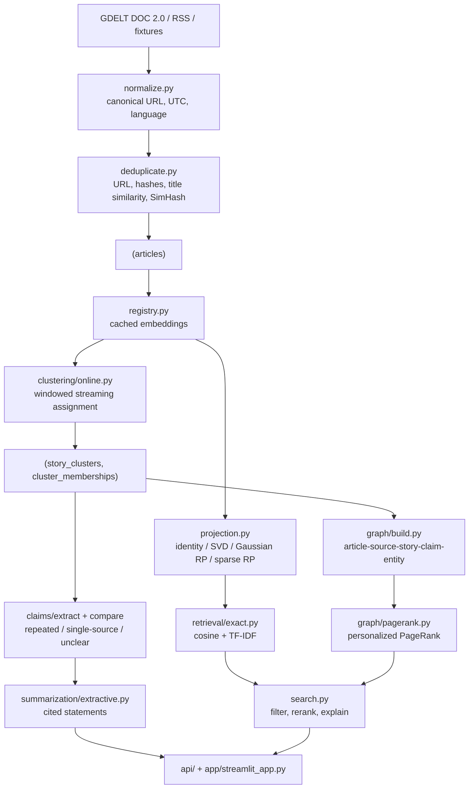

# Architecture

NewsTrace is a single Python package (`src/newstrace`) with four entry points —
CLI, FastAPI, Streamlit and the experiment scripts — over one SQLite database.
There is no queue, no worker pool and no service mesh: the local benchmarks in
`artifacts/experiments/` do not yet justify any of them.

## Data flow

## Module map

| Module | Responsibility |
| --- | --- |
| `config.py` | Environment-driven settings, topic and source-policy YAML |
| `db.py`, `models.py` | Engine/session management and the ORM schema |
| `ingestion/` | Source adapters, HTTP policy, normalisation, deduplication, run auditing |
| `representations/` | Embedding backends, the embedding cache, projectors |
| `clustering/` | Streaming assignment and rule-based labelling |
| `retrieval/` | Exact cosine and TF-IDF search, reranking, explanations |
| `claims/` | Claim extraction, cross-source comparison, evidence persistence |
| `graph/` | Typed news graph and personalized PageRank |
| `summarization/` | Grounded extractive summaries; optional LLM adapter |
| `evaluation/` | Metrics, chronological split, threshold tuning, experiment runner, reports |
| `stories.py`, `search.py`, `pipeline.py` | Service layer shared by every entry point |

## Design decisions

**Embeddings are pluggable, with a working default.** `sentence-transformers` is
an optional extra. When it is missing, `build_embedder` falls back to a
deterministic feature-hashing embedder so ingest, clustering, search and the
whole experiment suite still run offline. Cosine similarity is not comparable
across the two backends, so the clustering threshold is stored per backend
(`cluster_threshold`, `cluster_threshold_hashing`) and
`clustering.online.default_threshold` picks the right one.

**One blob per embedding.** `EmbeddingRecord` stores a float32 `LargeBinary`
keyed by `(article, model, method, dimension, fit_version)`. Compressed
representations are additional rows, so several representations coexist and
search can switch between them at query time.

**Clustering is single-pass and windowed.** `OnlineClusterer` only compares an
incoming article against clusters active in the recent window, and updates
centroids incrementally, so memory grows with live clusters rather than with
articles seen. Near-duplicates follow the article they duplicate and never move
a centroid or a source count.

**Duplicates are preserved, never deleted.** They stay queryable, carry
`duplicate_of_article_id` and a reason, and are excluded from
`distinct_domain_count`, independent-source counts and default search results.

**Every ranking is explainable.** `ScoredHit.signals` carries each contributing
signal and `retrieval/explain.py` renders it. There is no publisher-reputation
term anywhere, because it could not be explained or justified.

**Fitting is chronological.** Projectors and the clustering threshold are fitted
on the earliest 60% / next 20% of articles; the final numbers come from the last
20%. `ChronologicalSplit.assert_no_leakage` is called before every experiment.

## Persistence

SQLite via SQLAlchemy 2.x, with Alembic migrations in `migrations/`.
`IngestionRun` and `EvaluationRun` record configuration, seed, git commit,
counts, failures and artifact paths, so any run can be traced back to the code
and settings that produced it.
